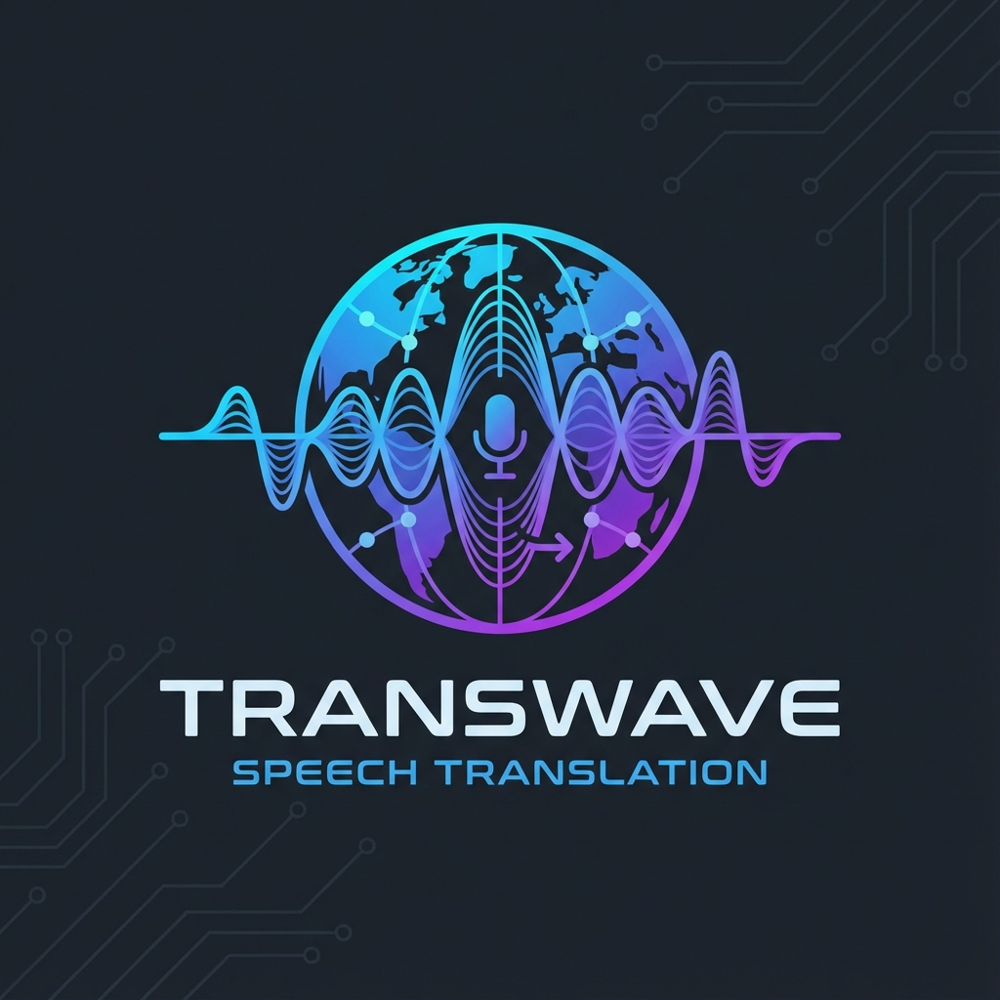

# SeamlessM4T v2 Speech-to-Speech Translation System

A production-grade, state-of-the-art speech-to-speech translation (S2ST) system powered by Meta's SeamlessM4T v2. This tool provides multiple interfaces for high-quality audio translation, including a CLI, a modern Web Dashboard, and a Browser Extension for real-time video translation.



## Features

- **High Quality S2ST**: Uses SeamlessM4T v2 for industry-leading translation quality.
- **Expressive Mode**: Preserves the original speaker's vocal characteristics (prosody, tone).
- **Multiple Interfaces**:
  - **CLI**: Robust command-line tool for batch processing.
  - **Web GUI**: Beautiful Vue.js dashboard for job management and monitoring.
  - **Browser Extension**: Real-time overlay translation for any video playing in your browser.
- **Background Worker**: SQLite-backed job queue for asynchronous processing.
- **Device Management**: Automatic GPU acceleration (CUDA/MPS) with CPU fallback.
- **Zero-Shot Voice Preservation**: Maintain speaker identity across languages.
- **Resource Efficient**: Smart chunking for long-form content conversion without high RAM usage.
- **Smart Streaming**: Integrated VAD (Voice Activity Detection) to skip silence during real-time translation.

## Installation

### Prerequisites

- Python 3.10+
- FFmpeg
- (Optional) NVIDIA GPU with CUDA or Apple Silicon for hardware acceleration.

### Setup

```bash
# Clone the repository
git clone https://github.com/rennerdo30/video-translate-direct.git
cd video-translate-direct

# Set up virtual environment
python -m venv venv
source venv/bin/activate

# Install dependencies
pip install -r requirements.txt
```

## Usage

### CLI Mode

```bash
# Single file translation
python tool/main.py translate --input audio.wav --target-lang deu

# Submit multiple jobs to the queue
python tool/main.py job submit --input ./my_recordings/ --target-lang fra
```

### Web dashboard

1. Start the API server:
   ```bash
   python tool/main.py gui --port 5000
   ```
2. Start the background worker:
   ```bash
   python tool/main.py worker
   ```
3. Open `http://localhost:5000` in your browser (or run the frontend dev server).

### Browser Extension

1. Go to `chrome://extensions/` in Chrome.
2. Enable "Developer mode".
3. Click "Load unpacked" and select the `extension/` directory.
4. Ensure the API server is running (`python tool/main.py gui`).
5. Open any video, click the extension icon, and select your target language.

## Docker Support

Run the entire system using Docker Compose:

```bash
docker-compose up -d
```

## Development

### Running Tests

```bash
pytest --cov=tool
```

### Frontend Development

```bash
cd frontend
npm install
npm run dev
```

## License

MIT
