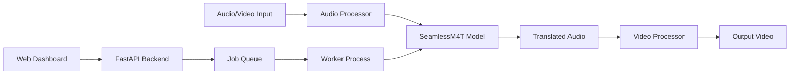

# Speakora

> Speech-to-Speech Translation Made Simple

A production-grade **Speech-to-Speech Translation** system using Meta's SeamlessM4T v2 model.


## Features

- **Real-time Translation** - Translate audio and video content between 100+ languages
- **Multiple Input Sources** - Support for audio files, video files, and YouTube URLs
- **Web Dashboard** - Modern Vue.js interface for job management
- **CLI Tool** - Powerful command-line interface for batch processing
- **GPU Acceleration** - CUDA, Metal (MPS), and ROCm support
- **Job Queue** - SQLite-backed job queue with pause/resume and checkpoint recovery
- **Docker Ready** - Optimized for containerized deployments including RunPod

## Supported Languages

Speakora supports translation between 100+ languages including:

| Region | Languages |
|--------|-----------|
| European | English, German, French, Spanish, Italian, Portuguese, Dutch, Polish, Russian, Ukrainian |
| Asian | Chinese (Mandarin), Japanese, Korean, Vietnamese, Thai, Indonesian |
| Middle Eastern | Arabic, Hebrew, Persian, Turkish |
| African | Swahili, Amharic, Yoruba |
| South Asian | Hindi, Bengali, Tamil, Urdu |

[View all supported languages](getting-started/configuration.md#supported-languages)

## Quick Start

=== "pip"

    ```bash
    # Clone the repository
    git clone https://github.com/rennerdo30/speakora.git
    cd speakora

    # Run setup
    ./setup.sh

    # Start the server
    ./start.sh
    ```

=== "Docker"

    ```bash
    # Pull and run with GPU support
    docker run -d \
      --gpus all \
      -p 8000:8000 \
      -v ./output:/app/output \
      ghcr.io/rennerdo30/speakora:latest
    ```

Open your browser to [http://localhost:8000](http://localhost:8000) to access the web dashboard.

## Architecture



## Requirements

- **Python 3.10+** (required for SeamlessM4T)
- **16GB+ RAM** for medium model, 24GB+ for large model
- **GPU** (recommended): NVIDIA CUDA, Apple Metal, or AMD ROCm
- **FFmpeg** for video processing

## License

MIT License - see [LICENSE](https://github.com/rennerdo30/speakora/blob/main/LICENSE) for details.
